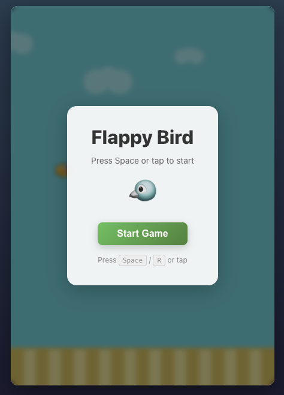

# Local LLM Test

A small experiment to test how far a local coding agent can go from a single prompt.

This project exists less as a Flappy Bird clone and more as a record of an agentic
local LLM workflow: generating an app, structuring it, validating it, fixing issues,
and leaving behind something runnable.

## Prompt

```text
Build a polished Flappy Bird clone as a real Vite React TypeScript app.
Create the project structure yourself instead of putting everything in one file.
Use clean, maintainable code with separate files for game logic, rendering, hooks and UI.
The game should use a canvas, requestAnimationFrame, gravity, jump velocity,
moving pipes, collision detection, score, best score and game over state.
It should support Space to jump, R to restart, and also mouse/touch input.
Make it look good enough to demo: centered layout, responsive canvas,
simple HUD, start screen and game over screen.
After creating the app, install dependencies, run a production build,
fix any TypeScript or lint errors, and tell me how to run it locally.
```

## Session Stats

- **User messages:** 1
- **Assistant messages:** 53
- **Tool calls:** 52
- **Tool results:** 52
- **Total messages:** 109
- **Input tokens:** 892,657
- **Output tokens:** 18,055
- **Total tokens:** 910,712

## Result

The agent produced a complete React + TypeScript Vite app with canvas rendering,
game state, collision detection, score tracking, keyboard/pointer input, overlays,
responsive layout, and a passing production build.



## Why This Is Interesting

The interesting part is not the game.

The interesting part is that agent-style development can burn through almost one
million tokens in a single small experiment once the model starts iterating,
validating, and fixing code.

That makes local LLM workflows interesting for developers. Not because cloud
models disappear, but because local inference gives you:

- No API cost per iteration
- No rate limits
- Fast experimentation
- Full control over the workflow
- A realistic playground for coding agents

## Run Locally

```bash
npm install
npm run dev
```

Open: http://localhost:5173

### Build

```bash
npm run build
```
